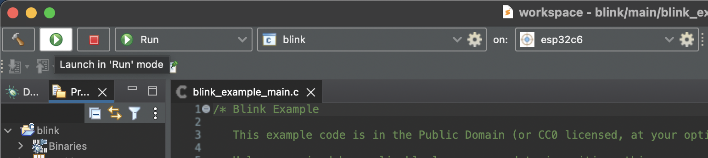

## Espressif IDE Workshop

### About this workshop

This hands-on workshop will introduce the Espressif IoT Development (ESP-IDF) development by the Integrated Development Environment (IDE). After this workshop, you will be able to use the IDEs to improve the development performance on your projects.

On this part, the Eclipse bundle, **Espressif IDE** will be introduced.

### Prerequisites

To follow this workshop, make sure you will meet the prerequisites, as described below.

#### Hardware Prerequisites

- Windows, Linux or macOS
- ESP32 board with USB to serial interface and/or debug port
  - USB CDC/JTAG
- USB cable compatible with your development board

#### Software prerequisites

- [UsbDriverTool](https://visualgdb.com/UsbDriverTool/)
- [Java 17 and above](https://www.oracle.com/technetwork/java/javase/downloads/index.html)
- [Python 3.6 and above](https://www.python.org/downloads/)
- [Git](https://git-scm.com/downloads)
- [Espressif IDE 3.0.0]()
- [ESP-IDF v5.2]()

#### Downloads

- [ESP-IDF Offline Installer for Windows](https://dl.espressif.com/dl/esp-idf/) (recommended for Windows users)
- [Espressif-IDE v3.0.0 macOS aarch64](https://dl.espressif.com/dl/idf-eclipse-plugin/ide/Espressif-IDE-macosx-cocoa-aarch64-v3.0.0.dmg)
- [Espressif-IDE v3.0.0 macOS x86-64](https://dl.espressif.com/dl/idf-eclipse-plugin/ide/Espressif-IDE-macosx-cocoa-x86_64-v3.0.0.dmg)
- [Espressif-IDE v3.0.0 Windows](https://dl.espressif.com/dl/idf-eclipse-plugin/ide/Espressif-IDE-3.0.0-win32.win32.x86_64.zip)
- [Espressif-IDE v3.0.0 Linux](https://dl.espressif.com/dl/idf-eclipse-plugin/ide/Espressif-IDE-3.0.0-linux.gtk.x86_64.tar.gz)

#### Extra resources



#### Completion time


**Estimated completion time: 30 to 45 min**


### Installing

Now it's time to install the Espressif IDE. Please follow the instructions according to your operating system.

#### Windows

For Windows, the recommended way is to install using the [ESP-IDF offline installer](https://dl.espressif.com/dl/esp-idf/). If you already have the ESP-IDF installed in your system and your are currently working with, you can reuse the installation and proceed directly with the [Espressif IDE install](https://dl.espressif.com/dl/idf-eclipse-plugin/ide/Espressif-IDE-3.0.0-win32.win32.x86_64.zip).

Please follow the instructions on the step-by-step guide:

#### Linux and macOS

If your system is Linux or macOS, you can intall the Espressif IDE by the links provided in the [downloads section](#downloads).

Make sure to install all [prerequisites](#software-prerequisites) before continue the Espressif IDE installation.

#### Installing ESP-IDF

To install the ESP-IDF, you can do it in two different ways:

- Manual install
- ESP-IDF Manager (Espressif IDE tool)

Depending on your operating system, we recommend to install via the offline installer. If you operating system does not support it, then the installation could be done via the ESP-IDF Manager inside the Espressif IDE.

The manual installation could be also used as an alternative solution.

For this workshop, we will skip the manual install, however, you can se how it works on our [Get Started Guide](https://docs.espressif.com/projects/esp-idf/en/release-v5.3/esp32c6/get-started/index.html#manual-installation).

After the installation process completed, you will be able to open the Espressif IDE.

The first step is to select your workspace folder. This folder is where all your projects will be stored.

Once you have selected, you can proceed by clicking on the `Launch` button.

#### Installing, upgrading or downgrading ESP-IDF versions

Before creating the first project, we need to install the ESP-IDF.

> TODO: Install the ESP-IDF 5.3

### Creating a new project

To create a new project, go to `File` -> `New` -> `Project`.

On the **New Project** screen, select `Espressif` -> `Espressif IDF Project` and click `Finish`.

Now we will select the `Create a project using one of the templates` and select the **blink** project.

Select the target for this project, in this case, the **ESP32-C6**.

Click finish to create the project on the selected workspace.

### Building the project

Building the project is done by the button with a hammer icon, as showed on the next image.

By clicking the build button, the build process will start. This operation can take a while depending on your operating system.

After finishing the build, you will be able to flash the application to the device.

### Project configuration

If you need to change any project or ESP-IDF configuration, this can be done by opening the `sdkconfig` file. After openning this file, you will see the SDK configuration interface, as showed in the image.

> Please not that if you change anything from this file, the build process will rebuild everything.

### Flash to the device

Before flashing the device, we need to define the communication port, by clicking on the gear icon.

If your board is already connected to your computer, and the operating system is able to recognize it, you will see the available com ports on the drop-down menu.


**Make sure you are using the devkit USB port labeled as USB**


Please select the one recognized as `USB JTAG/serial debug unit`.

Once you select the correct communication port, the board will be detected as you can see in the image.

Now to flash, you can click on the green orb with a "play" icon labled as `Launch in 'run' mode`.

After a successfuly flashing procedure, you will see the message in the console output:

If everything worked, you will see the RGB LED blinking in white color.

> TODO: Add a gif with the board blinking.

### Monitoring the serial output

On this project, the application will print some log output from the USB serial interface.

### Debugging

### Tools

#### Partition table editor

#### Components

### Conclusion

### Next steps